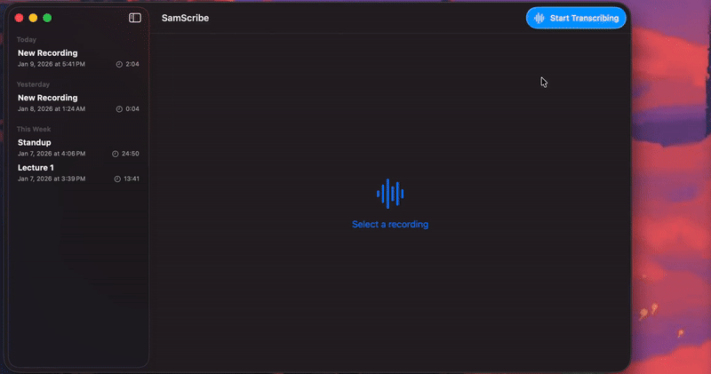

# SamScribe - AI-Powered Local Transcription App

An open-source macOS app that captures and transcribes audio from your microphone and meeting applications (Zoom, Teams, Chrome) in real-time, with cross-session speaker recognition.

Uses voice embeddings to remember speakers across sessions - name someone "Bob" once, and the app recognizes them automatically in future recordings.

Built with Swift, SwiftUI, and [FluidAudio](https://github.com/FluidInference/FluidAudio). All data stays local on your Mac.



---

## Features
- 🎤 **Real-time Transcription**: Transcribe audio as you speak with minimal latency
- 👥 **Speaker Diarization**: Automatically identify and separate different speakers
- 🔄 **Cross-Session Recognition**: Speakers persist across all recordings with voice embeddings
- 📝 **Editable Transcripts**: Click any segment to edit transcription text inline
- ✏️ **Speaker Management**: Rename speakers (e.g., "Speaker 1" → "Bob") with pencil icon
- 💾 **Persistent Storage**: All recordings saved locally with SwiftData
- 🔍 **Per-Process Capture**: Isolate audio from specific applications (Zoom, Teams, Chrome)

---

## Use Cases

- **Meeting Notes**: Automatically transcribe Zoom/Teams meetings with speaker identification
- **Interviews**: Record and transcribe interviews with automatic speaker separation
- **Podcasts**: Transcribe podcast recordings with persistent guest recognition across episodes
- **Lectures**: Capture classroom discussions with speaker attribution
- **Research**: Qualitative research interviews with cross-session participant tracking
- **Accessibility**: Real-time captions for audio content

---

## System Requirements
- **OS**: macOS 14.0+ or newer
- **XCode**: Version 16.0 or newer
- **Permissions**: Microphone access and Screen Recording access

---

## Development Installation

1. **Clone the repository:**
   ```bash
   git clone https://github.com/Steven-Weng/SamScribe
   cd SamScribe
   ```

2. **Open in Xcode:**
   ```bash
   open SamScribe.xcodeproj
   ```

---

## Usage

### Basic Usage

1. **Start Recording**: Click "Start Transcribing" button in the toolbar
2. **Grant Permissions**: Allow microphone and screen recording access when prompted
3. **Speak or Join Meeting**: Audio is captured and transcribed in real-time
4. **View Transcripts**: Transcription appears in the main detail view as you speak
5. **Edit Speakers**: Click the pencil icon next to any speaker name to rename them
6. **Edit Text**: Click any transcript segment to edit the text inline
7. **Stop Recording**: Click "Stop Transcribing" when finished

### Speaker Management

- Speakers are automatically detected and numbered (Speaker 1, Speaker 2, etc.)
- Click the pencil icon to rename speakers (e.g., "Bob", "Alice")
- Renamed speakers are **remembered across all future recordings**
- Voice embeddings enable automatic recognition with 0.65 similarity threshold
- "No Speaker" segments (background noise) don't have edit icons

### Editing Transcripts

- Click any segment to enter edit mode
- Make changes in the text editor
- Click "Save" to persist changes or "Cancel" to discard
- Click "..." menu for additional options (Delete)

### Recordings Management

- Recordings appear in the sidebar grouped by date (Today, Yesterday, This Week, etc.)
- Right-click any recording for options (Rename, Delete)
- Click a recording to view its transcript
- Active recordings show real-time elapsed timer

---

## License

This project is licensed under the MIT License - see the [LICENSE](LICENSE) file for details.

---

## Acknowledgments & Credits

- [FluidAudio](https://github.com/FluidInference/FluidAudio) - Excellent ASR and speaker diarization framework
- Apple's ScreenCaptureKit - Enabling per-process audio capture
- Apple's Accelerate framework - Optimized vector operations for embeddings
- SwiftUI & SwiftData - Modern Apple development stack

---

⭐ **Star this repo** if you find it useful! **Share** it with others who need better meeting transcription.